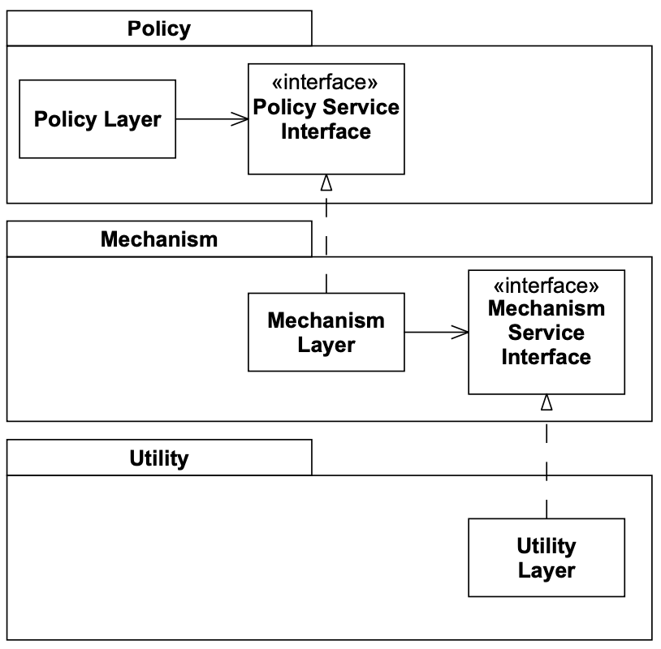

# Dependency Inversion Principle (DIP)

```text
a. High-level modules should not depend on low-level modules. Both should depend on abstractions.
b. Abstractions should not depend on details. Details should depend on abstractions. 
-- Robert C. Martin
```

The word _"inversion"_ may seem confusing. What this principle stands for is to invert the dependency tree. 

Traditional ways of coding tend to create program structures where high-level modules depends lower-level, making impossible to 
reuse the higher level modules and forcing developers to write code over and over again, making the code _immobile_ and filled 
with _needless repetition_.

## Layering

```text
 “...all well-structured object-oriented architectures have clearly defined layers, with each layer providing some coherent set 
of services though a well-defined and controlled interface.” -- Grady Booch
```

**Higher level layers (clients) should expose interfaces to the lower level layers (services) that they need.** This way the 
dependency is inverted because now the servers depends on an abstraction, and being the client's implementation invisible to the 
lower level layer, changes to the latter will not affect the implementation of the higher level layer.



Every layer is well bounded and remains untouchable by the other layers. The same happens with distributed systems and micro-services 
that expose an API. And since they have no dependencies, we can move around the upper box through different programs easily.

## Examples

- [Wrong](https://github.com/gonzispina/go-solid/tree/master/D/wrong): in this example we can see a furnace regulator (high-level policy).
The algorithm is clear but is tightly coupled to the details of how the thermometer and the furnace are implemented (mechanism layer). 
he algorithm is simple but is not reusable, is _immobile_. Particularly, in this case the utility layer is provided by go's
implementations of `bufio`, `fmt` and `io` packages.

- [Right](https://github.com/gonzispina/go-solid/tree/master/D/right): here we had separated the mechanism layer from policy layer
making the latter reusable. Our regulator now is separated from the lower level modules and it does not depend on how the lower level 
modules are implemented, is not into the details anymore. Instead it exposes the abstractions that needs to receive, and is up to
the mechanism layer to make the implementations of them.
  
